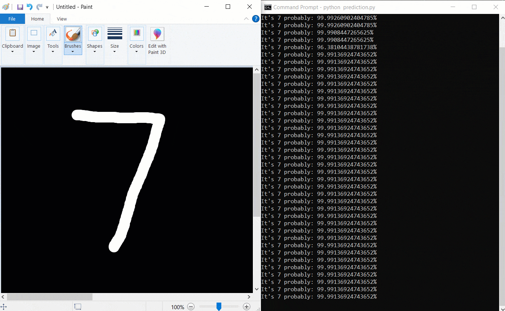

Created a CNN model and trained with mnist data set to predict the numbers that you drew on any paint program



### Setup
- If you want to train the model on your machine, just go to training.py and change training boolean param to True. It's **optional** because there is trained model which is mnist_model.h5.
- Open a ms paint window or any program you can draw
- Set the paint window 700x630 width:700 height:630.
- Drag the window to top left corner of computer screen and drop it. If you want to change these two settings you have to change top,left,right and buttom parameters in prediction.py
- Set the background color black and set the brush color white
- Open a cmd or terminal window and run prediction.py

```
python prediction.py
```
